# docker를 활용한 CI 구축  

팀내에서 아직 한땀 한땀 공들여서 배포를 하고있기에... 이에 불편함을 느끼고 있었는데 이와 관련해서 자료를 찾아보다 CI / CD에 대해 알게 되었습니다. 
이번에는 젠킨스를 통한 빌드 연습을 할 예정이며 이를 바탕으로 업무에서도 적용할 수 있도록 해보겠습니다.  
잘못된 내용이 있을수있으니 잘못됬거나 더 좋은 방법이 있으시다면 댓글 부탁드립니다.  

### 프로젝트 생성

테스트를 위해 스프링 부트 프로젝트를 생성 하고 이를 Githhub에 push 하였습니다.  
IDE나 빌드도구는 원하시는것을 사용하시면되겠습니다.  
  

### 도커를 통해 젠킨스 컨테이너 설치

다음 [링크](https://hub.docker.com/editions/community/docker-ce-desktop-mac)에서 Docker for mac을 설치 후 Kitematic을 실행합니다.
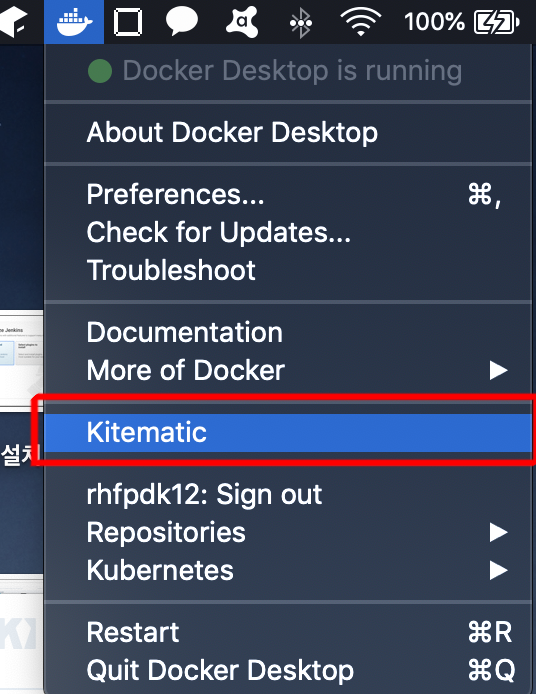  

Kitematic이 설치되어 있지 않으면 아래와 같은 화면이 나오는데 here를 선택하여 설치를 진행하시면 됩니다.  
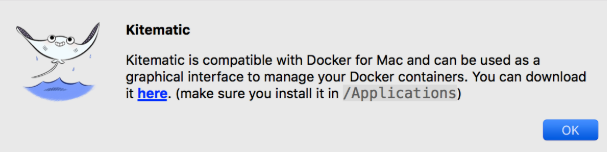  

Kitematic의 메인화면입니다. 화면에 보이는 젠킨스를 create합니다.  
(Kitematic은 설치 및 설정을 GUI를 통해 간단하게 할 수 있도록 해줍니다.)  
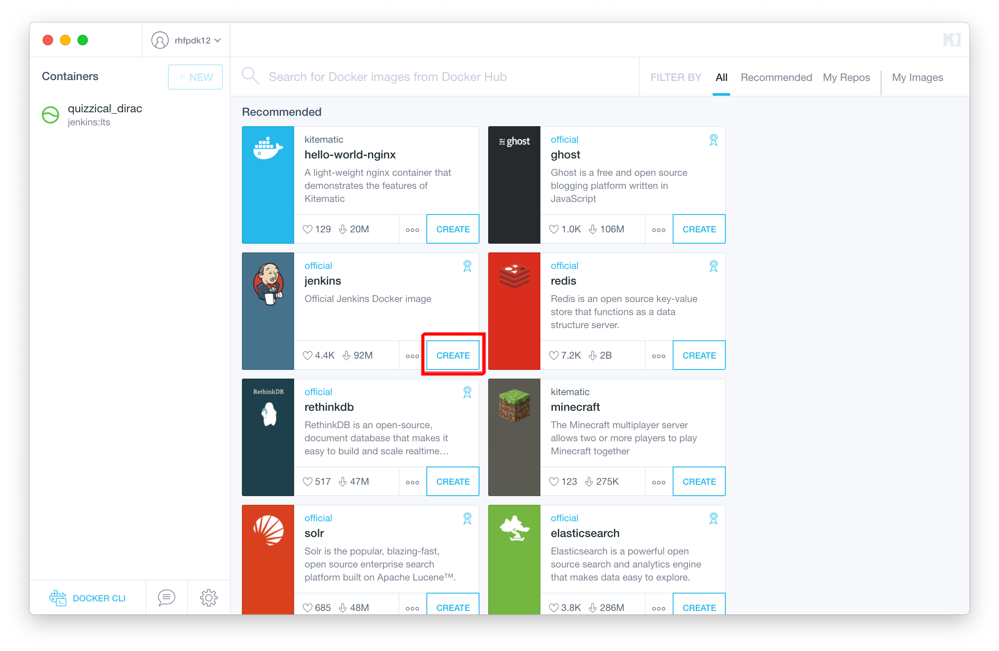  

설치 완료 후 아래 이미지를 보시면 password가 있습니다. 이는 접속시에 필요하니 따로 저장해둡시다.  
젠킨스 컨테이너에 접속해서 직접 확인할 수도 있습니다.(/var/jenkins_home/secrets/initialAdminPassword 확인)  
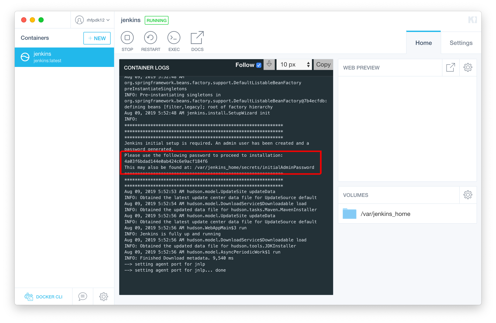  

터미널에서 컨테이너가 잘 설치되었는지 확인 할 수 있습니다.  
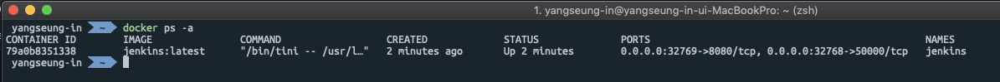  

젠킨스 컨테이너의 8080포트가 localhost의 32769포트로 연결되어 있음을 확인할 수 있고 localhost:32769로 접속을 하면 젠킨스의 패스워드를 입력하라는 페이지가 나옵니다. 아까 저장해둔 패스워드를 입력합니다.  
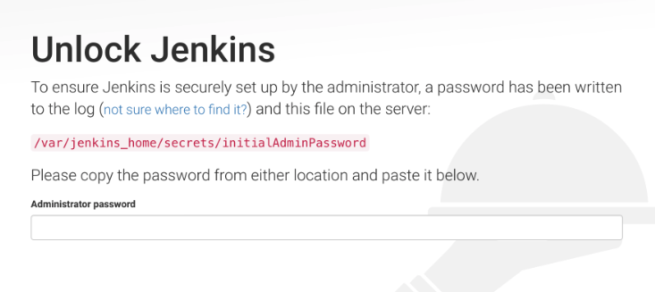  

패스워드입력 후 젠킨스 설치페이지가 나오는데 왼쪽의 Install suggested plugins를 선택합니다.  
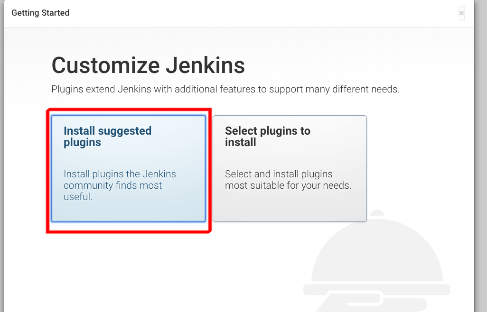  

그런데 플러그인의 설치가 실패하며 접속을 하여도 에러메세지가 많이 듭니다...  
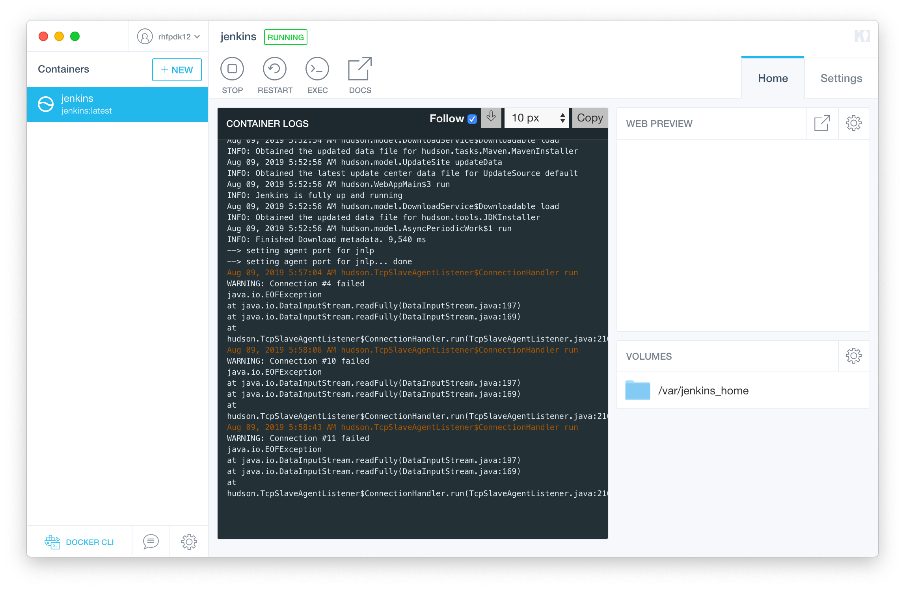  
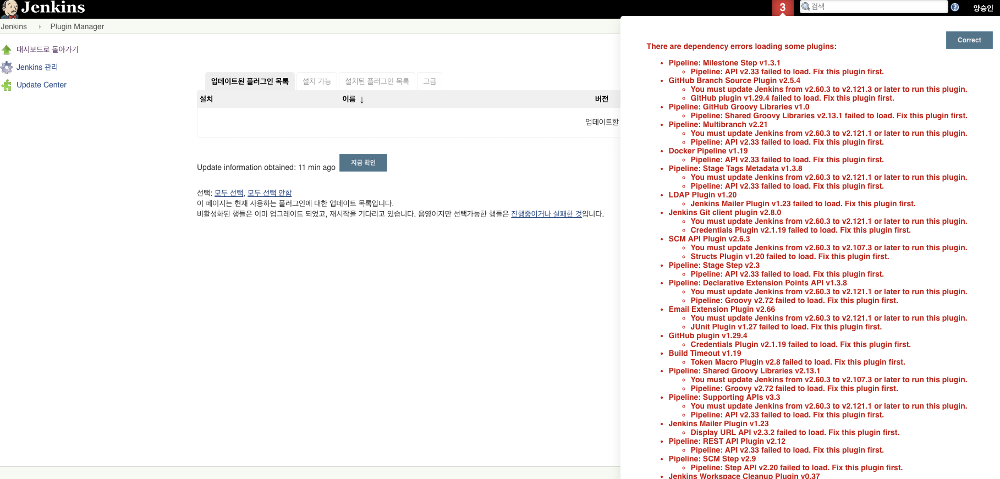  

구글링을 해보니 플러그인들과의 버전이 맞지않아? 설치가 안된다는 글을 찾았었는데 링크를 잃어버렸다...  
그래서 Kitematic을 이용하지 않고 jenkins/jenkins:lts 이미지로 설치하였습니다.  
터미널에 다음 명령어를 입력해줍니다.(포트는 다른것으로 쓰셔도됩니다.)  
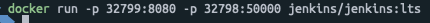  

설치가 끝난후  localhost:32799로 접속하여 괸리자 계정을 생성하시면  접속화면이 보이게됩니다.  
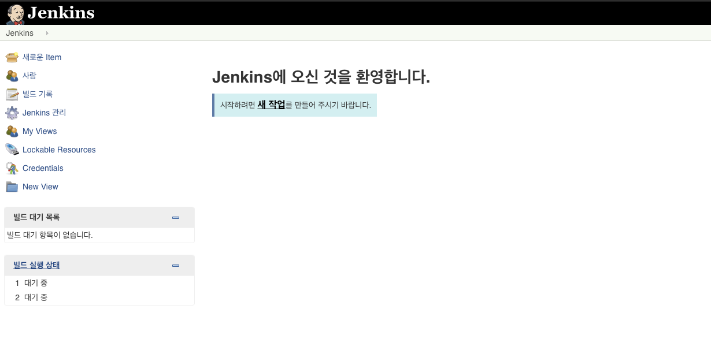  

### 젠킨스 Job 생성 및 Github 연동 
설치과정에서 install suggested plugins로 설치하였길래 github 플러그인이 설치되어 있습니다.  
좌측 상단의 새로운 item을 클릭합니다.  
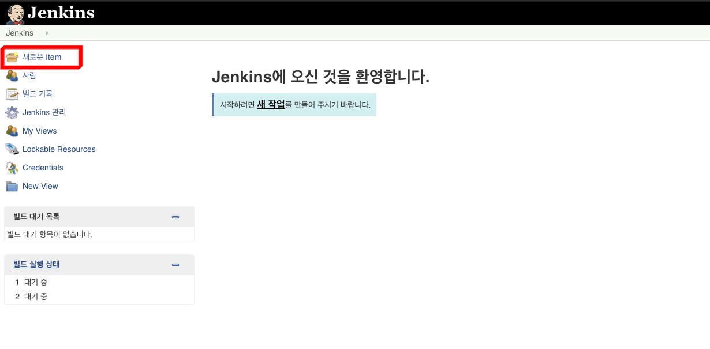  

item name을 입력후 Freestyle project를 선택해서 새 Job을 생성합니다.  
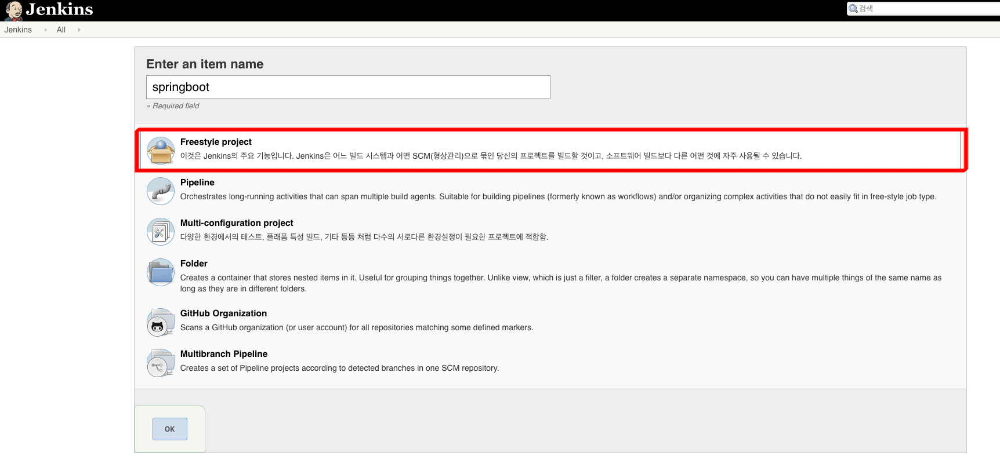  

아까 생성한 github 프로젝트의 url을 복사합니다.  
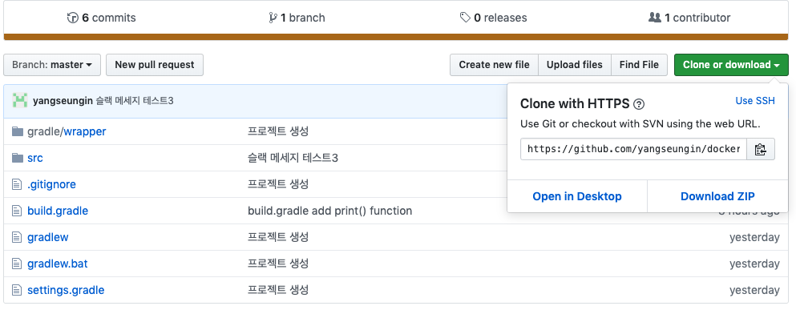  

item 설정화면의 소스관리 탭에서 git을 체크하고 Repository URL에 복사한 url을 입력하고 Credentials에 자신의 github 계정과 패스워드로 자격증명을 입력합니다.  
그 아래 bransch는 기본인 */master로 설정되어 있습니다.(다른 브랜치에 push할때 빌드되기 원할시 다른 브랜치를 넣어주면 됩니다.)  
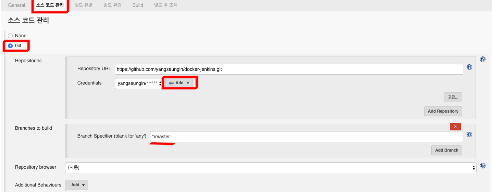  

빌드 트리거는 github hook trigger를 선택합니다.  
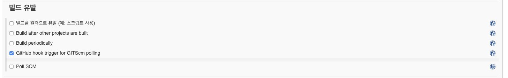  

Github의 브랜치에 push 되었을때 실행할 빌드명령어를 입력하기위해 Execute shell을 선택합니다.  
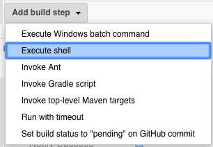  

프로젝트에 gradlew가 있으므로 command에 실행 할 gradle 명령어를 작성하고 저장합니다.  
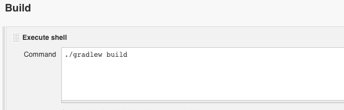  

현재 localhost에서 작업중이기 때문에 외부에서 접근할 수 없어서 ngrok를 사용하여 로컬네트워크를 외부에서 접속할 수 있게 설정해야 합니다.  
홈브루를 이용해 간단하게 설치합니다.  
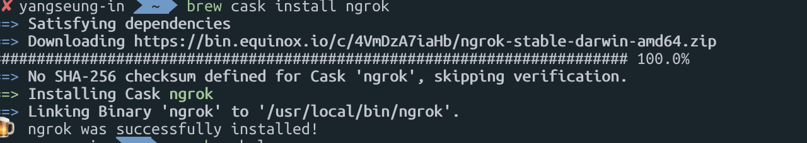  

examples에 나온것 처럼 로컬에 열려있는포트를 입력하면 ngrok도메인과 연결해줍니다.  
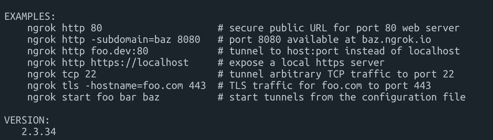  

아래와같이 외부에서 젠킨스의포트인 32799에 접근할 수 있도록 포트를 입력합니다.  
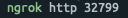  
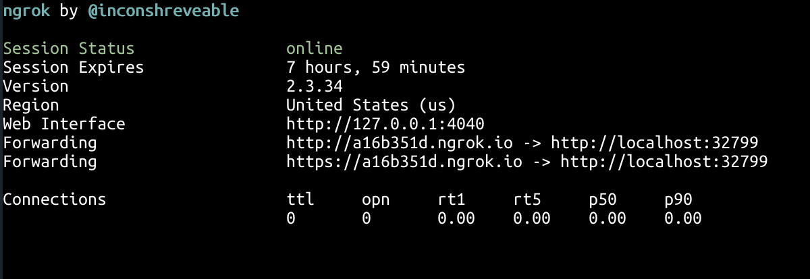  

http://a16b351d.ngrok.io 로 접근이 가능해진것을 확인할 수 있습니다.  
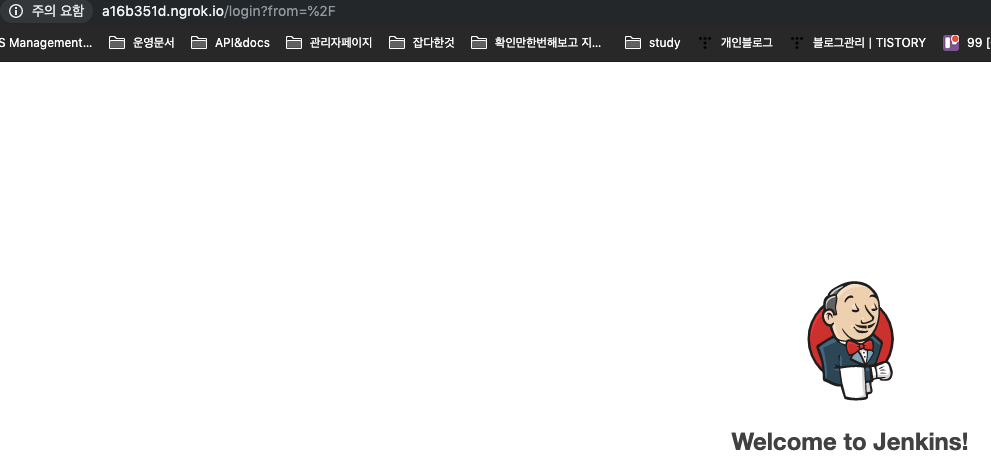  

이제 외부에서 젠킨스에 접근가능하니 Github과 연동하여 push가 발생했을때 자동으로 build가 되도록 설정하면 됩니다.  
프로젝트 상단의 Settings 에서 Integrations & service에 가보니  deprecated 되었다고 합니다. webhook을 이용합시다.  
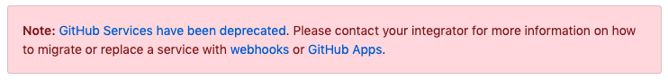  

Settings > Webhooks에가서 Add webhook을 선택합니다.  
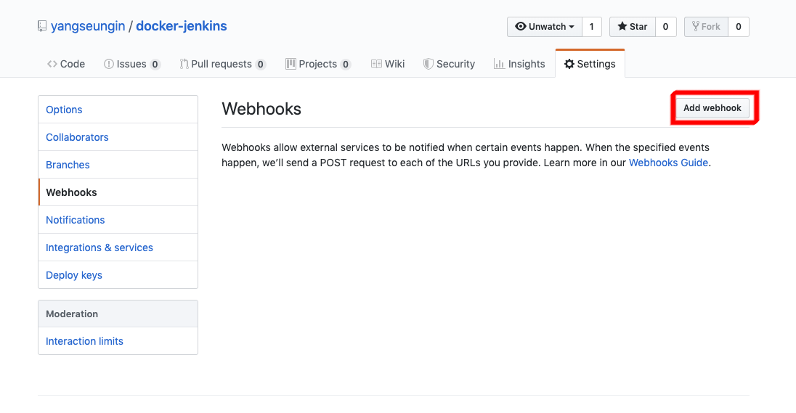  

Url은 젠킨스 주소뒤에 /github-webhook/ 를 입력해주면된다.(맨 끝에 /를 꼭 넣어줘야 합니다.)  
push이벤트 외에도 다른 이벤트들이 발생할떄마다 트리거링을 하려면 Let me select individual events.를 선택후 원하는 이벤트를 체크하면 됩니다.  
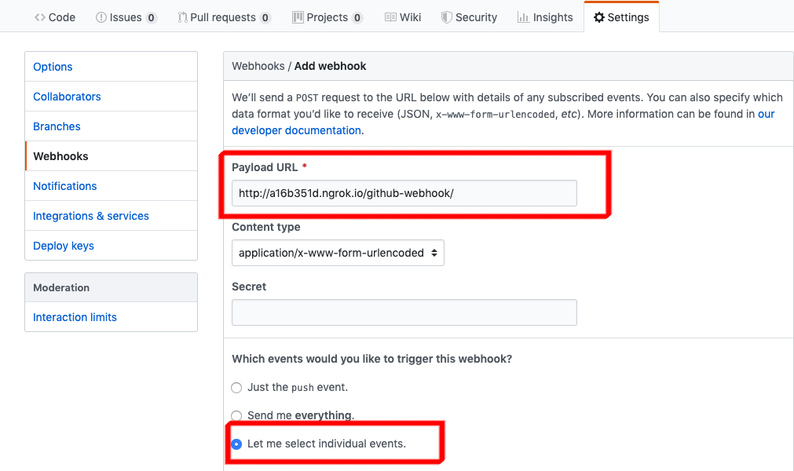  

등록 후 들어가서 맨아래에 Recent Deliveries에 ping test를 보면 정상적으로 응답받은 것을 볼 수 있습니다.  
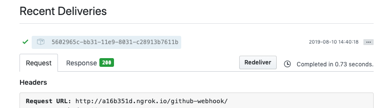  

프로젝트화로 들어가서 Build Now를 통해 바로 빌드를 수행할 수 있습니다.  
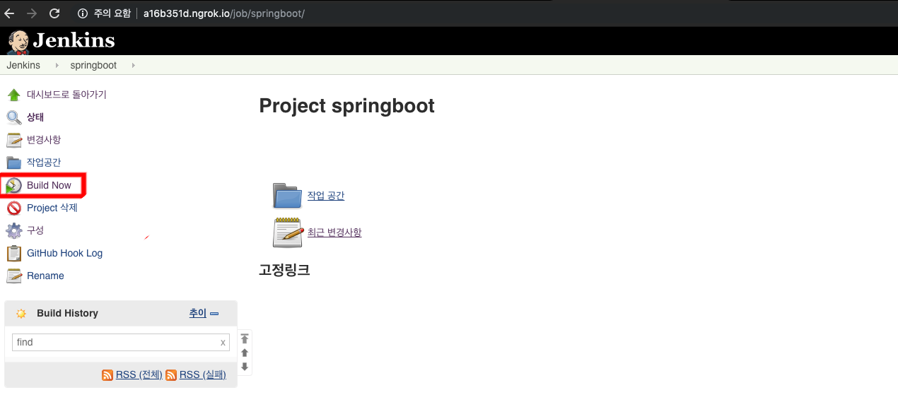  

빌드가 끝나고 확인해보면 정상적으로 수행된 것을 확인할 수 있습니다.  
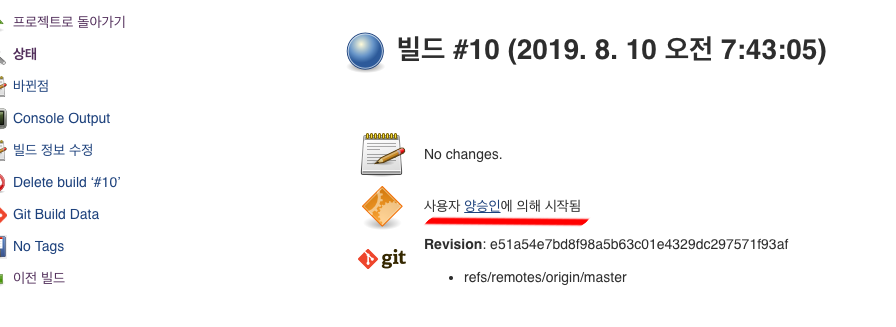  

빌드가 정상적으로 동작하니 Github의 webhook도 잘 되는지 확인합시다.  
프로젝트를 수정 후 master 브랜치에 push를 하겠습니다.(현재 master브랜치에만 webhook을 걸었습니다.)  
그러면 Github의 push에의해 빌드가 시작된 것을 알 수 있습니다.  
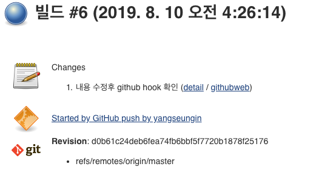  

### Slack에 Jenkins Build 메세지 받기
Slack에 접속하셔서 메세지를 받을 Channel을 생성합니다.  
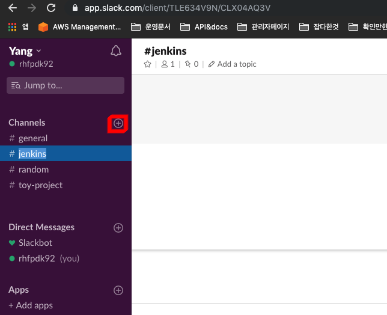  
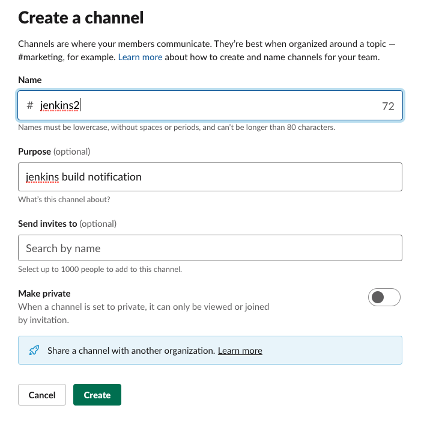  

젠킨스에서 사용할 인증토큰을 생성하기위해 administration > Manage apps로 갑니다.  
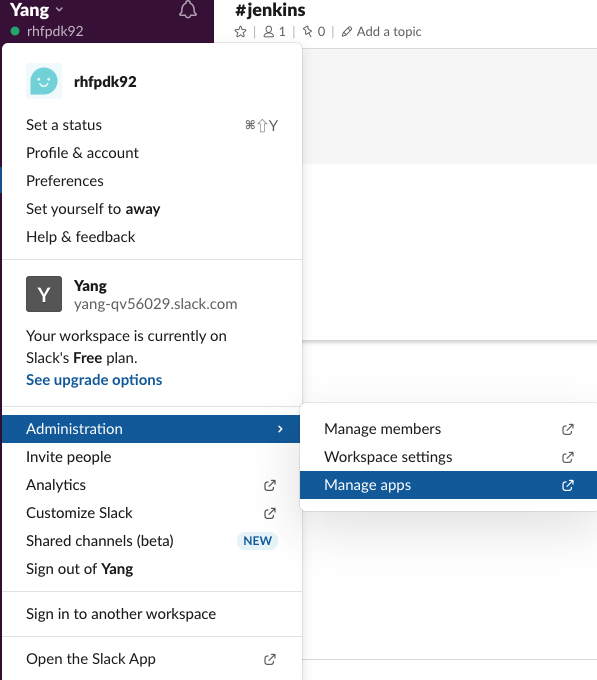  

Jenkins CI를 검색후 추가하고 채널을 입력합니다.  
  
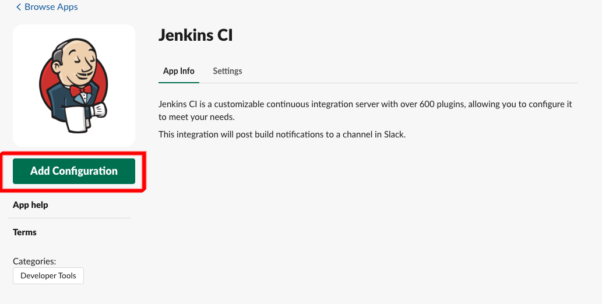  
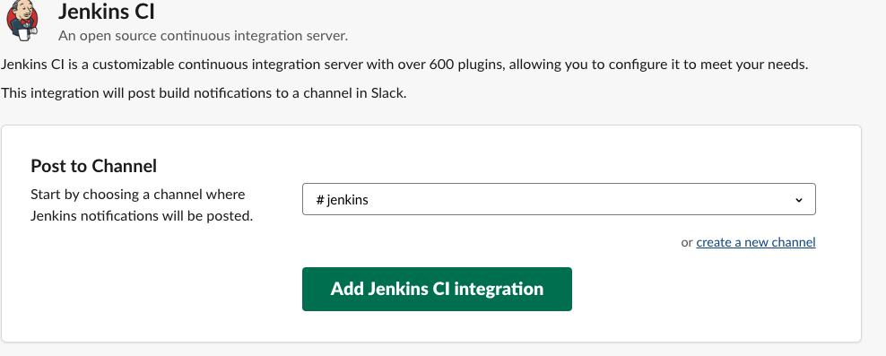  

연동가이드가 나오게 되는데 step3에서  Team Subdomain, 과 Integration Token을 저장해둡니다.  
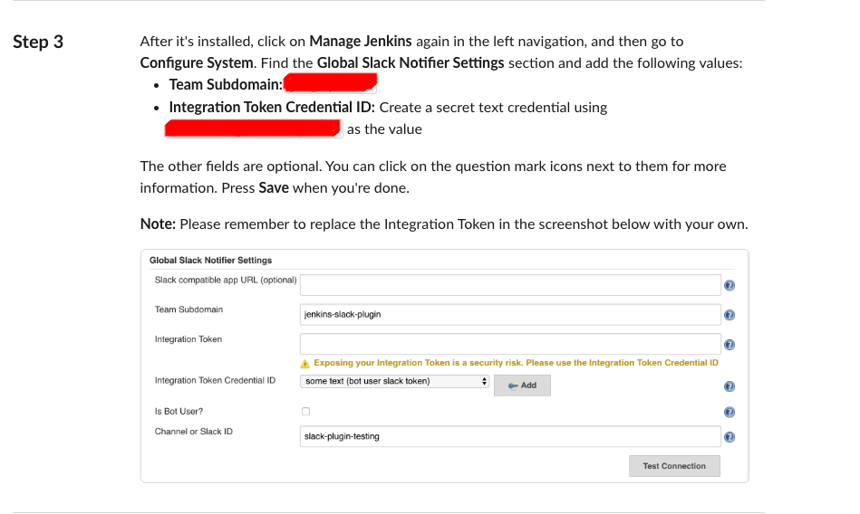  

다시 젠킨스로 돌아와 slack 플러그인을 설치합니다.  
Jenkins관리 > 플러그인 관리 > 설치가능 페이지에서 slack 검색 후 설치합니다.  
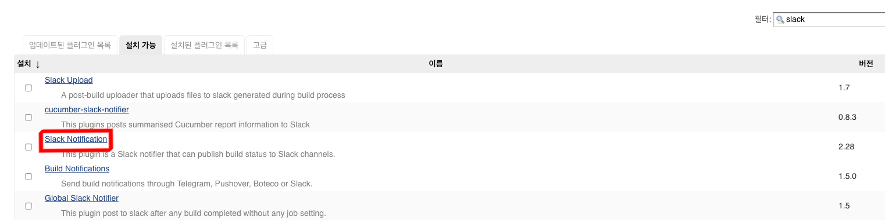  

그리고나서 jenkins관리 > 시스템설정> Global Slack Notifier Setting를 찾아서  
아까 저장해둔 team subdomain, Integration Token 그리고 채널을 입력한 후 Test Connection을하여 Success가 뜨면 저장합니다.  
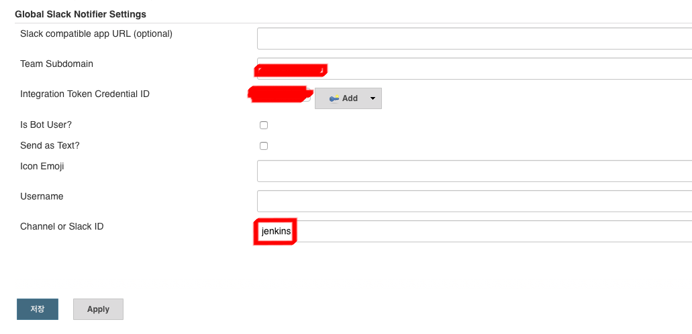  

마지막으로 프로젝트의 구성 > 빌드 후 조치 추가 > Slack Notification을 선택한후 슬랙 메세지를 보내고싶은 것들을 체크합니다.
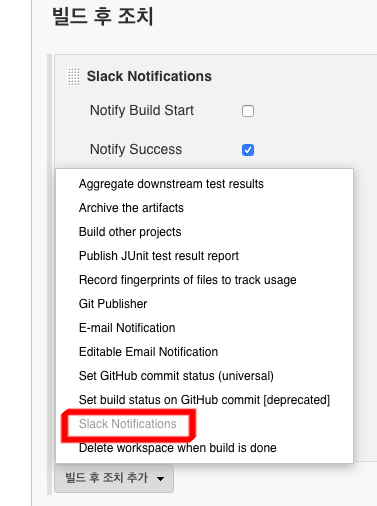  
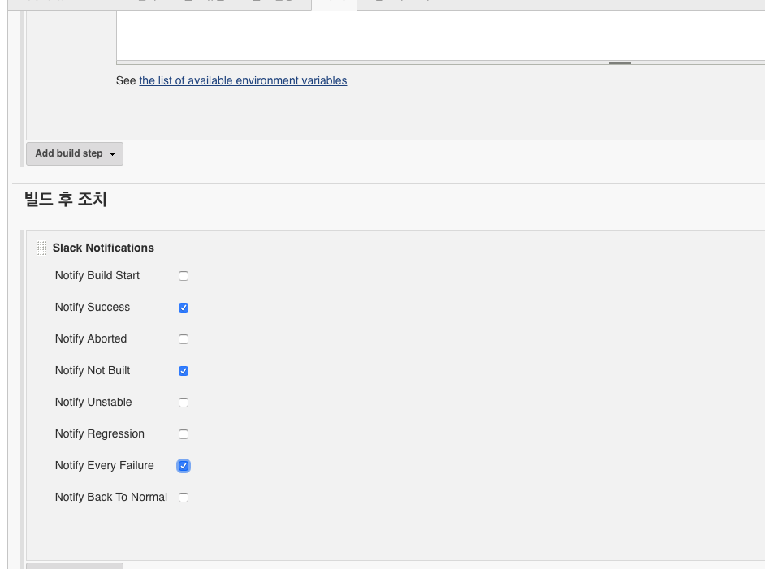  

모든 설정이 완료되었고 slack 메세지가 오는지 확인하기 위해 Github에 push하고 Slack의 Jenkins채널에서 메시지가 출력되는것을 확인하실 수 있습니다.  
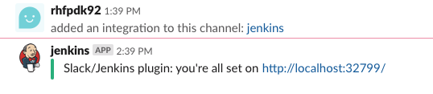  

### 정리
이렇게 해서 Docker로 Jenkins를 설치하고 github 프로젝트와 연동하여 push 발생 시 자동으로 빌드가 되며 slack을 통해 메세지 알림까지 받는 부분을 완료하였습니다.빌드만 자동화된것이지 배포까지 자동화된것이 아니라 이부분은 빌드 스크립트를 작성하여 진행해볼 예정입니다.  

### 참고자료
 - [jojoldu님 블로그](https://jojoldu.tistory.com/139)  
 - [꿈꾸는 태태태의 공간](https://taetaetae.github.io/2018/02/08/github-web-hook-jenkins-job-excute)
 - [GitHub Developer](https://developer.github.com/webhooks)
